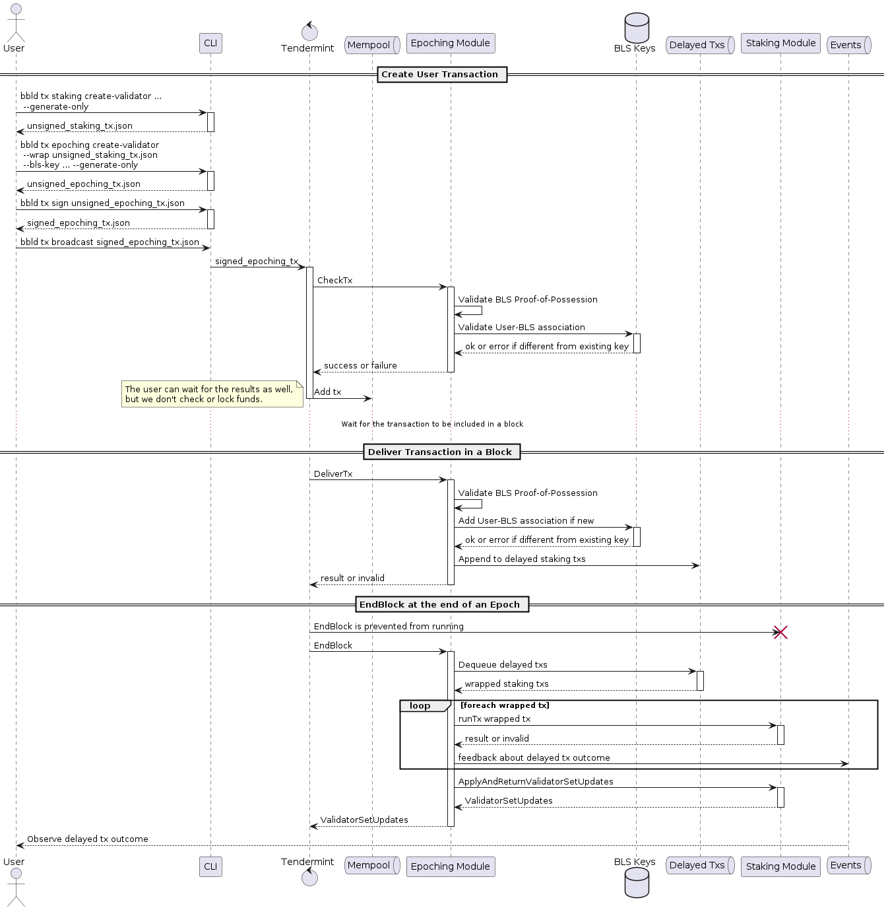
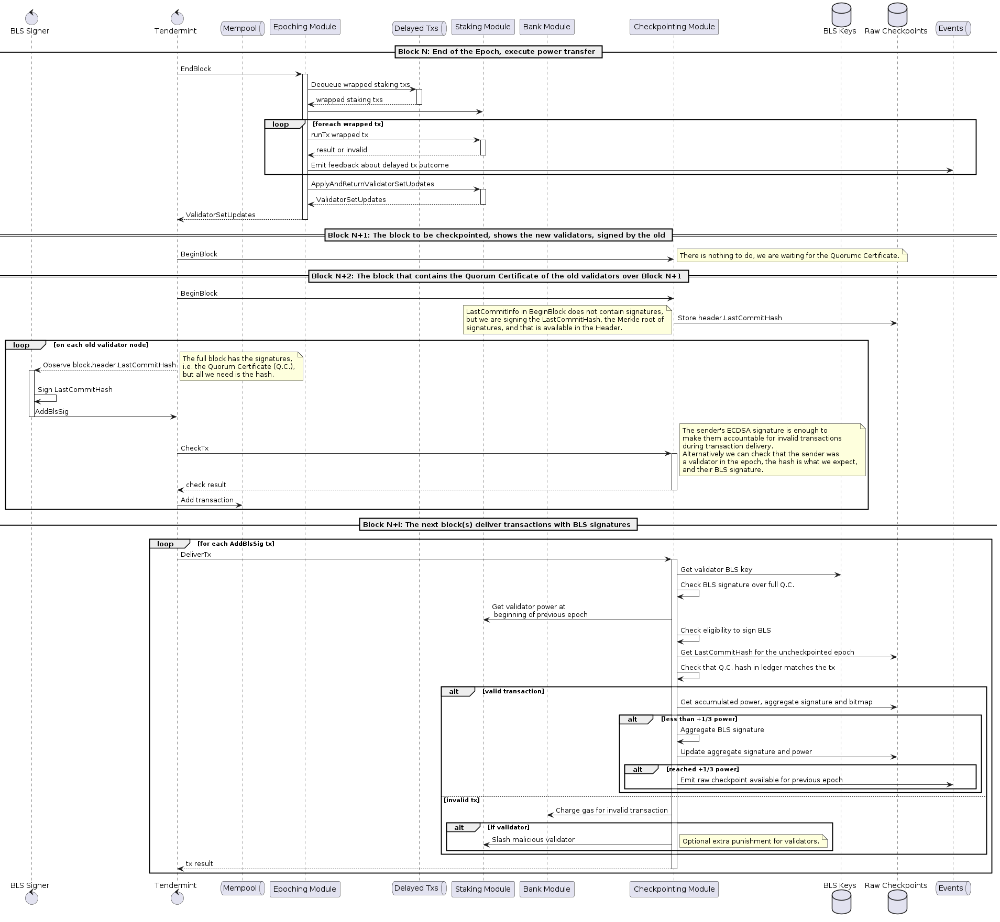
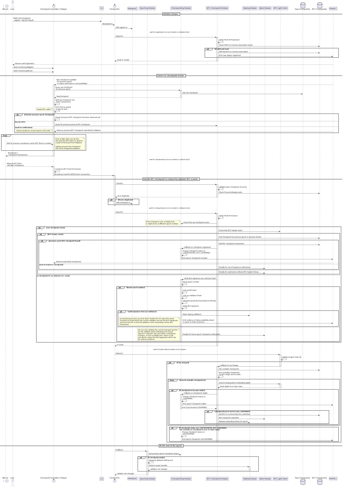
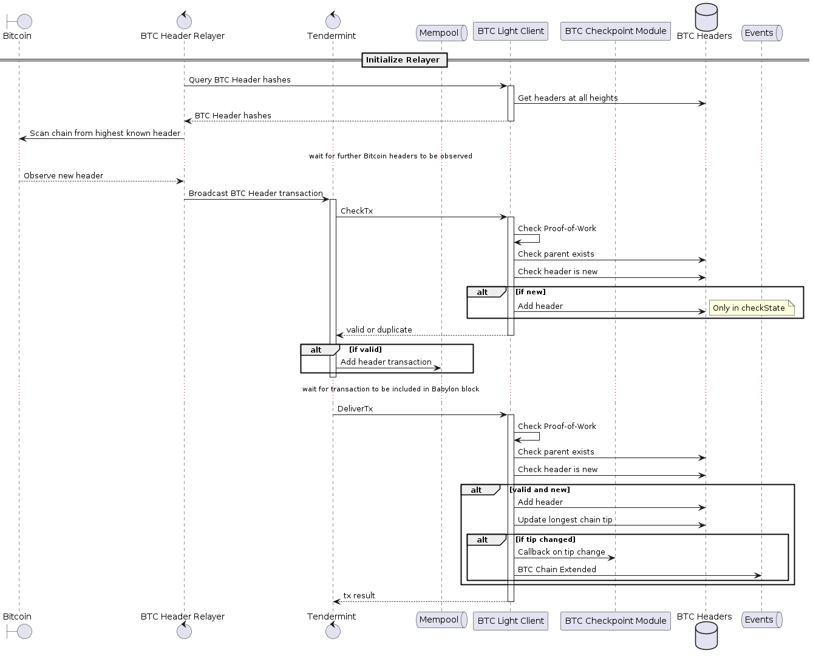
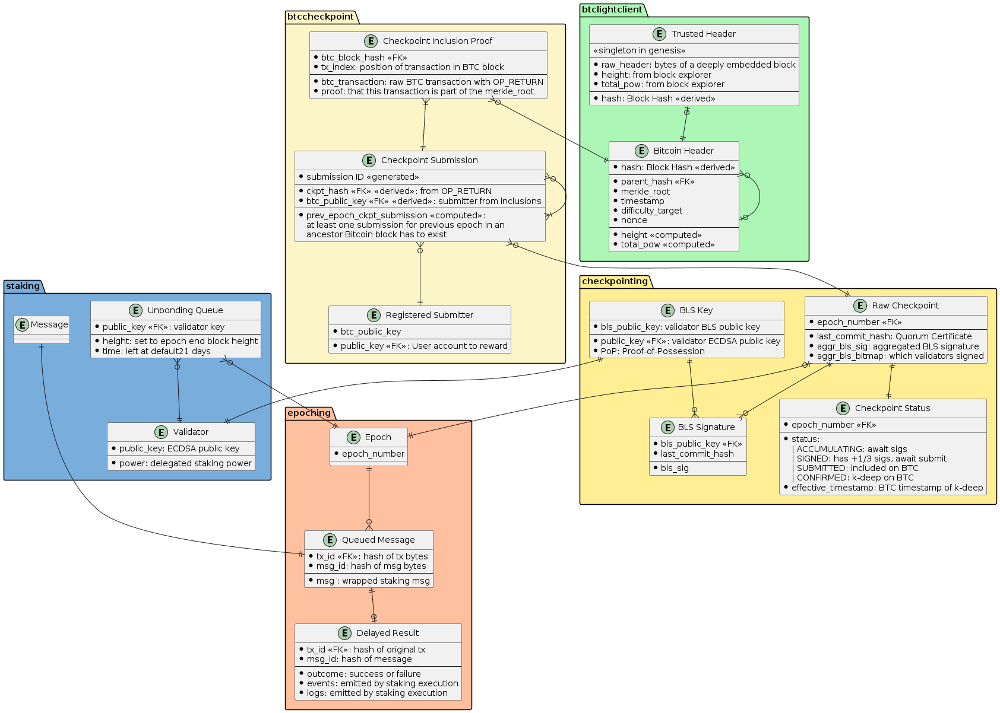

# Babylon Chain

## Workflows

The following are the most prominent workflows. The diagrams depict cross-module communication, which hopefully helps us build a common picture of the high level interactions of the system.

### Validator Registration and Staking

In order to support regular checkpointing, Babylon has two extensions over the regular Tendermint consensus:
* the use of epochs, during which the validator set in stable
* the use of BLS keys for signature aggregation

In order to keep changes to the Cosmos SDK to a minimum and maximize code reuse, the `epoching` module _wraps_ the `staking` module: the regular staking transactions are still used, but enveloped in a Babylon transaction that allows us to attach extra data as well as to control when these transactions are executed.



### Creating a Raw Checkpoint

The next diagram depicts the process of the power transfer that takes place at the end of an epoch, the collection of a Quorum Certificate, and the accumulation of the BLS signatures into a raw checkpoint as soon as the +1/3 of the validators have submitted their signatures.



### Submit Checkpoint

Once the raw checkpoint is available, vigilantes take it and send them to Bitcoin,
paying the BTC fees, for future rewards on Babylon.



### BTC Light Client

To be able to confirm checkpoints we need to know how deeply embedded they are into the Bitcoin mainchain. This requires an on-chain light client, which relayers feed each bitcoin header they observe.



## Database Schema

Even though we use a Key-Value store instead of a Relational Database, the following Entity Relationship Diagram is useful to get a sense of the conceptual data model, including the cardinalities. The grouping shows which module the collections belong to in the design.

Note that some boxes are actually _messages_ and aren't part of the storage schema, they are just there to illustrate where some of the entities are coming from, or to establish a relationship between entities that come to life as a result of a common message, but then live separately without explicit foreign keys between them.



## Automation

Adding the following to `.git/hooks/pre-commit` automatically renders and checks in the images when we commit changes to the diagrams. CI should also check that there are no uncommitted changes.

```bash
#!/usr/bin/env bash

# If any command fails, exit immediately with that command's exit status
set -eo pipefail

# Redirect output to stderr.
exec 1>&2

if git diff --cached --name-only | grep .puml
then
  make diagrams
  git add docs/diagrams/*.png
fi
```
