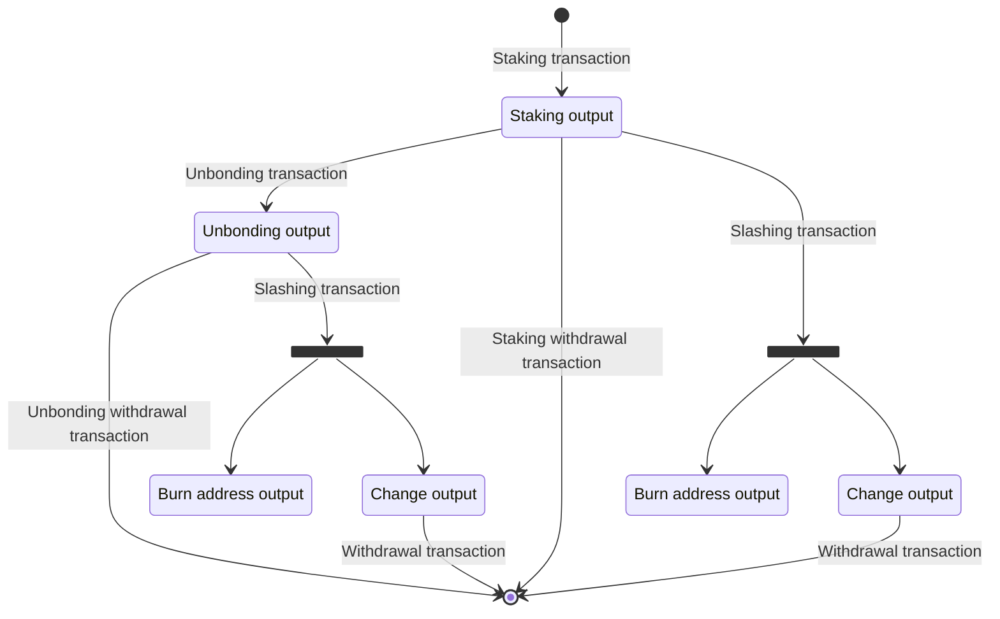

# Staking BTC script

## Introduction

Babylon's BTC staking protocol turns Bitcoin into a staking asset with the aim
to enhance the economic security of the Babylon chain. Bitcoin holders can stake
their Bitcoin by locking them using a special transaction on the Bitcoin chain.
The locked Bitcoin contribute to Babylon chain's economic security and generate
yields for the Bitcoin stakers.
The protocol has the following important properties:

1. The staking is trustless and self-custodial, meaning it does not require
   bridging, wrapping, 3rd-party custody/multi-sig, or oracle.
2. The stake voting power is delegatable, a common feature of Delegated PoS
   (DPoS) protocols.
3. Stake security: the staked bitcoin is slashed if and only if the BTC staker
   itself (and in case of delegation, its delegatee) is malicious. This implies
   that, even if the Babylon chain is compromised and taken over by malicious
   actors, as long as the BTC staker itself (and the validator it delegates to
   in case of delegation) is not malicious, its bitcoin stake is secure.
4. The protocol supports fractional slashing, meaning the protocol can be
   configured so that when slashing happens, only a fraction of the staked
   bitcoins are slashed, and the rest is returned to the staker.
5. The protocol allows stakers to on-demand unbond, On-demand unbonding, means
   the BTC staker can withdraw from staking with an unbonding delay.
6. Atomic slashing, meaning that if a delegator is slashed, then all the
   delegators of the same delegatee, including the delegatee's self-delegation,
   will be subject to slashing. In other words, the delegatee cannot
   selectively harm any specific delegator.
7. (WIP) restakable, meaning that the same bitcoin can be staked to secure
   multiple PoS chains and earn multiple PoS yields

The key to making all these possible is special constructions of BTC
transactions using BTC scripts.

## Preliminary

Babylon interaction with Bitcoin is heavily based on Bitcoin's
[Taproot upgrade](https://github.com/bitcoin/bips/blob/master/bip-0341.mediawik).
This design choice was made due to the heavy usage of
[Schnorr signatures](https://github.com/bitcoin/bips/blob/master/bip-0340.mediawiki)
that were introduced through the Taproot upgrade.

## Staking Flow

Following diagram shows how different transactions described in following
paragraphs create and spend different bitcoin outputs:



Withdrawal transactions are btc transactions which transfer bitcoins to the btc
staker wallet.

## Types of special transactions

There are three special transaction types recognized by the Babylon chain:

- Staking Transaction
- Unbonding Transaction
- Slashing Transaction

### Staking Transaction

A BTC holder gains voting power by creating a staking transaction. This is a
Bitcoin transaction that commits a certain amount of to-be-staked bitcoin to
Babylon recognised BTC staking scripts. These scripts lock the stake for a
chosen amount of BTC blocks and enable other features such as unbonding and
slashable safety.

The requirements for a valid staking transaction are:

- it can contain arbitrary number of inputs
- it can contain arbitrary number of outputs. One of those outputs must be
  a Taproot output committing to the BTC staking scripts recognized by Babylon.
  Henceforth known as `Staking Output`.

### Unbonding Transaction

The BTC staker utilises the unbonding transaction when they want to unlock
their stake before their originally committed timelock has expired.

The requirements for a valid unbonding transaction are:

- it contains exactly one input which points to staking transaction's `Staking
Output`.
- it contains exactly one output which must be a Taproot output committing to
  the BTC unbonding scripts recognized by Babylon. Henceforth known as `Unbonding
Output`.

### Slashing Transaction

The slashing transaction is used to punish a BTC staker when they (or the
finality provider they have delegated to) perform an offense.

The requirements for a valid slashing transaction are:

- it must have exactly one input pointing to either the staking output or the
  unbonding output
- it must have exactly two outputs, the first sending the slashed fraction of
  the funds to a burn address specified in the Babylon chain's parameters and the
  second sending the remaining funds back to the BTC staker's address.
- the fee for the slashing transactions must be larger than or equal to the
  minimal fee specified in Babylon's parameters

## Staking and Unbonding output scripts

### Staking output

The staking output is a taproot output which can only be spent through a script
spending path.
The key spending path is disabled by using the "Nothing Up My Sleeve"
(NUMS) point as internal key. Chosen point is the one described in
[BIP341](https://github.com/bitcoin/bips/blob/master/bip-0341.mediawiki#constructing-and-spending-taproot-outputs)
i.e,

```
H = lift_x(0x50929b74c1a04954b78b4b6035e97a5e078a5a0f28ec96d547bfee9ace803ac0)
```

which is a point constructed by taking the hash of the standard uncompressed
encoding of the secp256k1 base point `G` as the X coordinate.

The staking output can be spent by three script spending paths.

#### 1. Timelock path

The timelock path locks the staker's Bitcoin for a pre-determined number of
Bitcoin blocks. It commits to a script of the form:

```
<Staker_PK> OP_CHECKSIGVERIFY  <Timelock_Blocks> OP_CHECKSEQUENCEVERIFY
```

where:

- `<Staker_PK>` is the BTC staker's public key..
- `<Timelock_Blocks>` is the lockup period denoted in Bitcoin blocks. The
  timelock comes into effect after the Bitcoin transaction has been included in a
  mined block. In essence, the script denotes that only the staker can unlock the
  funds after the timelock has passed. It must be lower than `65535`.

#### 2. Unbonding path

The unbonding path allows the staker to on-demand unlock their locked Bitcoin
before the timelock expires. It commits to a script of the form:

```
<StakerPk> OP_CHECKSIGVERIFY
<CovenantPk1> OP_CHECKSIGADD <CovenantPk1> OP_CHECKSIGADD ... <CovenantPkN> OP_CHECKSIGADD
<CovenantThreshold> OP_GREATERTHANOREQUAL
```

where:

- `Staker_PK` is the BTC staker's public key
- `CovenantPk1..CovenantPkN` are the lexicographically sorted public keys of the
  current covenant committee recognized by the Babylon chain
- `CovenantThreshold` is a Babylon parameter specifying the number of how many
  covenant committee member signatures are required.

Signatures from a quorum of the covenant committee are required to ensure that
this script is not used for on-demand unlocking without the stake going through
an unbonding period. reward all covenant members for their work.

#### 3. Slashing path

The slashing path is utilized for punishing finality providers and their
delegators in the case of double signing. It commits to a script:

```
<StakerPk> OP_CHECKSIGVERIFY
<FinalityProviderPk> OP_CHECKSIGVERIFY
<CovenantPk1> OP_CHECKSIGADD <CovenantPk1> OP_CHECKSIGADD ... <CovenantPkN> OP_CHECKSIGADD
<CovenantThreshold> OP_GREATERTHANOREQUAL
```

where:

- `StakerPK` is the BTC staker's public key
- `FinalityProviderPk` is the BTC public key of the finality provider to which
  the staker delegates their stake
- `CovenantPk1..CovenantPkN` are the lexicographically sorted public keys of the
  current covenant committee members recognized by the Babylon chain
- `CovenantThreshold` is a Babylon parameter denoting how many covenant
  committee member signatures are required.

This path can only be executed with the collaboration of the BTC staker,
finality provider, and covenant committee.
It is used in following way:

- for stake to become active, staker must publish pre signed slashing transaction
- covenant committee validates such transaction, and publish its own signatures.
- the only signature missing to send slashing transaction is finality provider
  signature. If finality provider private key leaks due to infractions, anyone can
  sign slashing transaction and send slashing transaction to Bitcoin network.

#### Difference between Unbonding and Slashing Path

The main difference between the unbonding and slashing paths is the existence of
`FinalityProviderPk` in the slashing path.

This leads to following system wide repercussions:

- for staking request to become active, btc holder needs to provide valid
  unbonding transaction in this staking request. This staking request will become
  active only when `CovenantThreshold` signatures will be received by Babylon
  chain. Lack of `FinalityProviderPk` in unbonding path, means that after
  delegation becomes active, staker can send unbodning transaction any time
  without asking finality provider for permission.
- existence of `FinalityProviderPk` in slashing path, coupled with the fact that
  btc holder needs to provide pre-signed slashing transaction which needs to be
  signed by covenant committee for delegation request to become active, leads to
  situation in which the only signature missing to send slashing transaction to
  btc is signature of finality provider.

### Unbonding output

Unbonding output is a taproot output which can be only spent through script
spending path. The key spending path is disabled by using "Nothing Up My Sleeve"
(NUMS) point as internal key. Chosen point is the one described in BIP341 i.e H
= lift_x(0x50929b74c1a04954b78b4b6035e97a5e078a5a0f28ec96d547bfee9ace803ac0)
which is point constructed by taking the hash of the standard uncompressed
encoding of the secp256k1 base point G as X coordinate.

Unbonding output can be spent by two script spending paths.

#### 1. Timelock path

The timelock path locks the staker's Bitcoin for a pre-determined number of
Bitcoin blocks. It commits to a script of the form:

```
<Staker_PK> OP_CHECKSIGVERIFY  <Timelock_Blocks> OP_CHECKSEQUENCEVERIFY`
```

where:

- Staker_PK is btc holder public key
- Timelock_Blocks is unbonding time. It must be lower or equal 65535, but larger
  than `max(MinUnbondingTime, CheckpointFinalizationTimeout)`. `MinUnbondingTime`
  and `CheckpointFinalizationTimeout` are Babylon parameters.

#### 2. Slashing path

The slashing path is utilised for punishing finality providers and their
delegators in the case of double signing. It commits to a script:

```
<StakerPk> OP_CHECKSIGVERIFY
<FinalityProviderPk> OP_CHECKSIGVERIFY
<CovenantPk1> OP_CHECKSIGADD <CovenantPk1> OP_CHECKSIGADD ... <CovenantPkN> OP_CHECKSIGADD
<CovenantThreshold> OP_GREATERTHANOREQUAL
```

where:

- `StakerPK` is the BTC staker's public key
- `FinalityProviderPk` is the BTC public key of the finality provider to which
  the staker delegates their stake
- `CovenantPk1..CovenantPkN` are the lexicographically sorted public keys of the
  current covenant committee members recognized by the Babylon chain
- `CovenantThreshold` is a Babylon parameter denoting how many covenant
  committee member signatures are required.

#### Existence of Slashing path in Unbonding output

The fact that slashing path exists in unbonding output means that even if staker
is unbonding he can be slashed if finality provider commits infraction during
unbonding time.
